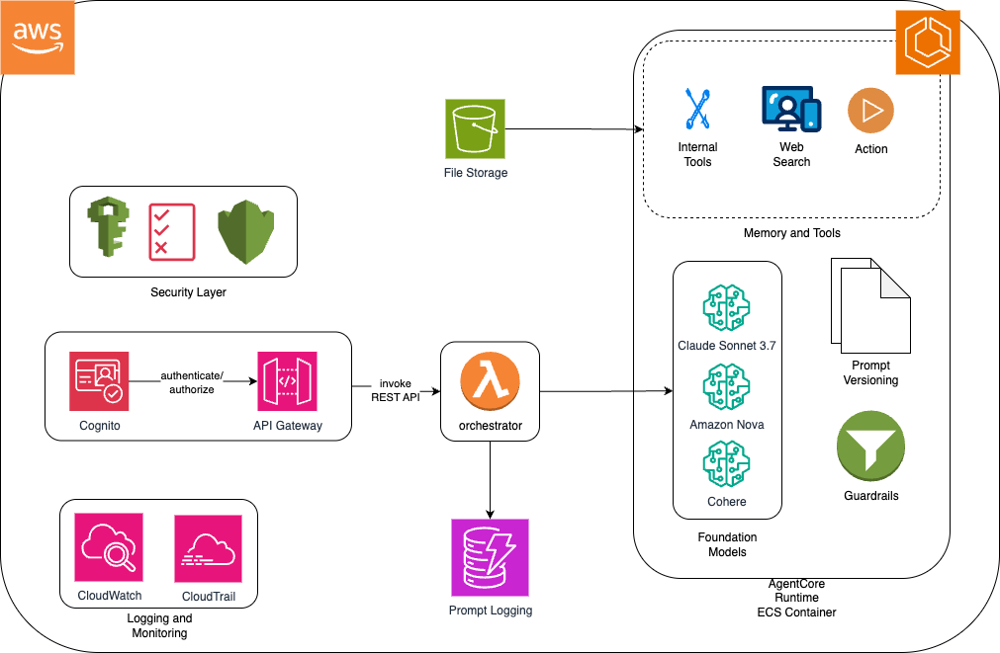

# Bedrock AgentCore QuickStart

A production-ready serverless AI agent platform built on AWS Bedrock AgentCore, featuring multi-agent workflows, tool integration, and comprehensive monitoring.

## 🏗️ Architecture Overview

This project deploys a complete serverless AI agent infrastructure with the following components:



- **Amazon Bedrock AgentCore** - Serverless AI agent runtime with memory and tools
- **API Gateway** - RESTful API with Cognito authentication
- **Lambda Integration** - Bridge between API Gateway and AgentCore Runtime
- **Cognito User Pool** - User authentication and authorization
- **DynamoDB** - Short-term memory storage for conversation context
- **S3** - Long-term memory artifacts and agent storage
- **Secrets Manager** - Secure API key management
- **CloudWatch** - Monitoring, logging, and observability
- **X-Ray** - Distributed tracing for performance analysis

## 🚀 Quick Start

### Prerequisites

- [AWS CLI](https://aws.amazon.com/cli/) configured with appropriate credentials
- [AWS CDK](https://docs.aws.amazon.com/cdk/latest/guide/getting_started.html) v2.x
- Node.js 18+ and npm
- Python 3.12+
- [AgentCore CLI](https://docs.aws.amazon.com/bedrock-agentcore/latest/devguide/getting-started.html): `pip install bedrock-agentcore-starter-toolkit`

### Installation

1. **Clone the repository**
   ```bash
   git clone <repository-url>
   cd AgentCore-Quickstart
   ```

2. **Install dependencies**
   ```bash
   cd infra
   npm install
   ```

3. **Deploy the complete system**
   ```bash
   # Recommended: Use the automated deployment script
   ./scripts/deploy-agentcore.sh <client-name> <aws-profile>
   
   # Alternative: Manual deployment
   cd infra && npx cdk deploy --profile your-aws-profile
   cd ../agentcore_agents
   agentcore configure --entrypoint app.py --name agentcore_quickstart --region <aws-region> --non-interactive
   agentcore launch
   ```

5. **Test the agent**
   ```bash
   # Test with AgentCore CLI
   agentcore invoke '{"prompt": "Calculate 15 * 8 + 42"}'
   agentcore invoke '{"prompt": "What time is it now?"}'
   agentcore invoke '{"prompt": "Search for latest AI developments"}'
   ```

## 📁 Project Structure

```
├── agentcore_agents/          # AgentCore agent implementation
│   ├── app.py                # Main agent with multi-agent workflow
│   ├── tools/                # Custom tool implementations
│   ├── requirements.txt      # Python dependencies
│   └── .bedrock_agentcore.yaml # AgentCore configuration
├── functions/                # Lambda functions
│   └── agentcore-integration/
│       ├── index.py          # Lambda handler for API Gateway
│       ├── requirements.txt  # Lambda dependencies
│       └── README.md         # Function documentation
├── infra/                    # AWS CDK infrastructure code
│   ├── lib/                  # CDK stack definitions
│   │   └── agentcore-stack.ts
│   ├── test/                 # CDK tests
│   └── package.json          # CDK dependencies
├── scripts/                  # Deployment and utility scripts
│   ├── deploy-agentcore.sh   # Automated deployment script
│   └── validate-deployment.sh # Deployment validation
├── docs/                     # Comprehensive documentation
│   ├── README.md             # Documentation overview
│   ├── cdk-infrastructure.md # CDK infrastructure guide
│   ├── agentcore-development.md # Agent development guide
│   ├── tool-integration.md   # Tool integration patterns
│   ├── deployment-guide.md   # Production deployment
│   ├── bedrock-agentcore-walkthrough.md # Complete system overview
│   └── troubleshooting.md    # Common issues and solutions
├── client-deployments/        # Client-specific deployments
└── README.md                 # This file
```

## 📚 Documentation

### Core Guides
- [CDK Infrastructure](docs/cdk-infrastructure.md) - AWS infrastructure setup and configuration
- [AgentCore Development](docs/agentcore-development.md) - Building and deploying agents
- [Tool Integration](docs/tool-integration.md) - Adding custom tools and external APIs
- [Deployment Guide](docs/deployment-guide.md) - Production deployment and scaling
- [Bedrock AgentCore Walkthrough](docs/bedrock-agentcore-walkthrough.md) - Complete system overview
- [Troubleshooting](docs/troubleshooting.md) - Common issues and solutions

## 🔧 API Usage

### Agent Interaction

```bash
# Direct AgentCore CLI usage
agentcore invoke '{"prompt": "Your question here"}'

# API Gateway integration (for frontend)
curl -X POST https://YOUR_API_GATEWAY_URL/agent \
  -H "Content-Type: application/json" \
  -H "Authorization: Bearer YOUR_COGNITO_TOKEN" \
  -d '{"prompt": "Your question here"}'
```

### Available Tools

The agent comes with pre-configured tools:

- **Calculator** - Mathematical operations
- **Time Tool** - Current date and time
- **Web Search** - Real-time information via Tavily API

### Custom Tool Development

```python
from strands.tools import tool

@tool
def custom_tool(input_data: str) -> str:
    """Your custom tool implementation."""
    # Tool logic here
    return result
```

## 🏃‍♂️ Development

### Adding New Tools

1. Create tool function in `agentcore_agents/app.py`
2. Add `@tool` decorator
3. Register with agent: `tools=[existing_tools, new_tool]`
4. Redeploy: `agentcore launch`

### Adding External Integrations

1. Store API keys in AWS Secrets Manager
2. Create tool class with proper error handling
3. Add IAM permissions in CDK stack
4. Test and deploy

### Local Development

```bash
# Test CDK stack
cd infra
npx cdk synth
npx cdk diff

# Test agent locally
cd agentcore_agents
agentcore launch --local
```

## 📊 Monitoring

### CloudWatch Logs
- Agent execution logs: `/aws/bedrock-agentcore/runtimes/agentcore_quickstart-XXXXX-DEFAULT`
- Lambda function logs: `/aws/lambda/AgentCoreIntegrationLambda`
- API Gateway logs: `/aws/apigateway/AgentCoreApi`

### X-Ray Tracing
- End-to-end request tracing
- Performance bottleneck identification
- Error root cause analysis

### Custom Metrics
- Agent execution time
- Tool usage patterns
- Memory utilization
- Error rates and success metrics

### Monitoring Commands

```bash
# Monitor agent logs
aws logs tail /aws/bedrock-agentcore/runtimes/agentcore_quickstart-XXXXX-DEFAULT \
  --log-stream-name-prefix "2025/10/24/[runtime-logs]" \
  --profile your-aws-profile

# Check Lambda logs
aws logs tail /aws/lambda/AgentCoreIntegrationLambda \
  --profile your-aws-profile
```

## 🔒 Security

- **Cognito Authentication** - JWT-based user authentication
- **API Gateway Authorization** - All endpoints protected with Cognito
- **Secrets Management** - API keys stored in AWS Secrets Manager
- **IAM Least Privilege** - Minimal required permissions for all components
- **Encryption** - Data encrypted at rest and in transit
- **VPC Support** - Can be extended with VPC and security groups

## 🎯 Use Cases

This QuickStart is perfect for:

- **Customer Support** - Multi-agent customer service workflows
- **Research & Analysis** - Automated research with web search tools
- **Content Generation** - AI-powered content creation
- **Data Processing** - Custom tool integration for data workflows
- **Enterprise Integration** - RDS, knowledge bases, and external APIs
- **Custom Workflows** - Extensible agent-based applications

## 🧹 Cleanup

### Quick Cleanup
To remove all resources:

```bash
cd infra
npx cdk destroy --profile your-aws-profile
```

### Agent Cleanup
```bash
cd agentcore_agents
agentcore delete agentcore_quickstart
```

⚠️ **Warning**: This will permanently delete all data including agent memory and configurations.

## 🆘 Support

For technical support and questions:

- Review the comprehensive documentation in the `docs/` directory
- Check the [Troubleshooting Guide](docs/troubleshooting.md) for common issues
- Submit issues with detailed reproduction steps and logs

## 🚀 What's Next?

1. **Customize Tools** - Add your specific business logic tools
2. **Integrate Data** - Connect to your databases and APIs
3. **Scale Up** - Configure auto-scaling and monitoring
4. **Deploy Frontend** - Build a React/Angular frontend using the API
5. **Multi-Agent Workflows** - Create complex agent orchestration

---

**Ready to build with AgentCore?** Start with `./scripts/deploy-agentcore.sh <client-name> <aws-profile>`! 🚀